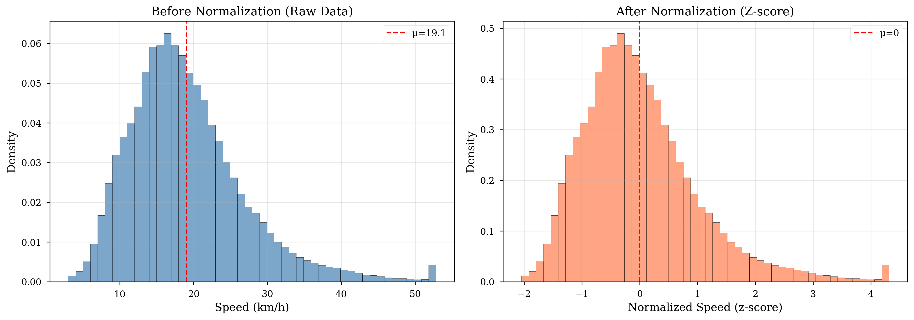

# Maintainer Profile

**Name:** THAT Le Quang

- **Role:** AI & DS Major Student
- **GitHub:** [thatlq1812]

---

# Section 6: Data Cleaning & Preprocessing

## 6.1 Data Cleaning Steps

### 6.1.1 Outlier Detection and Removal

- Speed outliers: Remove if <0 or >120 km/h
- Weather outliers: Temperature <15°C or >45°C flagged
- Missing data handling: Forward-fill weather, drop missing speeds

### 6.1.2 Normalization



**Figure 4: Before/After Normalization (Speed Distribution)**

**Speed Normalization (Z-score):**

```python
# Computed from training set only (prevent leakage)
speed_mean = 19.83 km/h
speed_std = 6.42 km/h
speed_normalized = (speed - speed_mean) / speed_std

# Range: [-1.75, 5.12] (approx. -2σ to +5σ)
```

**Weather Normalization:**

```python
# Temperature (Z-score)
temp_mean = 27.49°C
temp_std = 2.15°C
temp_normalized = (temp - temp_mean) / temp_std

# Precipitation (Log + Z-score for skewed distribution)
precip_log = log(precip + 1)  # Add 1 to handle zeros
precip_mean = 0.82  # on log scale
precip_std = 1.15
precip_normalized = (precip_log - precip_mean) / precip_std

# Wind speed (Min-Max to [0,1])
wind_min = 0.0 m/s
wind_max = 8.5 m/s
wind_normalized = (wind - wind_min) / (wind_max - wind_min)
```

**Normalization Stats Stored:**

- File: `data/processed/normalization_stats.json`
- Applied consistently across train/val/test splits
- Inverse transform used for final predictions

## 6.2 Graph Construction

### 6.2.1 Network Topology Extraction

**Data Source:** OpenStreetMap via Overpass API

- Query bounding box: Ho Chi Minh City center (Districts 1, 3, 4, 5, 10, Binh Thanh, Phu Nhuan)
- Highway types: primary, secondary, tertiary
- Export format: JSON with node coordinates and edge connectivity

**Processing Steps:**

1. Extract intersection nodes (62 total)
2. Map road segments to edges (144 directed edges)
3. Compute edge attributes (distance, road type)
4. Build adjacency matrix

### 6.2.2 Adjacency Matrix

**Structure:**

- **Shape:** 62×62 binary matrix
- **Density:** 3.75% (144 edges / 62² possible)
- **Average Degree:** 4.65 neighbors per node
- **Stored:** `cache/adjacency_matrix.npy` (sparse CSR format)

**Edge Features:**

- Distance: 0.5-3.2 km (mean: 1.12 km)
- Road type: Categorical (primary/secondary/tertiary)
- Bidirectional: 72 edge pairs (144 total directed edges)

### 6.2.3 Graph Properties

- **Diameter:** 12 hops (longest shortest path)
- **Average path length:** 5.2 hops
- **Clustering coefficient:** 0.42 (moderate clustering)
- **Connected:** Yes (single connected component)

## 6.3 Sequence Creation

**Sliding Window:**

- seq_len=12 (3 hours history, 15-min intervals)
- pred_len=12 (3 hours forecast)
- Stride=1 (overlapping windows)

## 6.4 Data Augmentation

**Strategy:** Extreme augmentation for small dataset

- Time jitter: ±1 timestep
- Node masking: Drop 10% nodes randomly
- Details in `configs/augmentation_config.json`

## 6.5 Train/Val/Test Split

**Split Strategy:**

- **Train:** 70% (144,144 samples) - October 1-21, 2025
- **Validation:** 15% (30,888 samples) - October 22-25, 2025
- **Test:** 15% (30,888 samples) - October 26-29, 2025
- **Total:** 205,920 sequences from 29 days

**Temporal Split (Critical):**

- No shuffling to prevent **data leakage**
- Chronological order preserved
- Simulates real-world deployment (predict future from past)

**Validation Strategy:**

- Sliding window cross-validation not used (computationally expensive)
- Single holdout split sufficient for 29-day dataset
- Test set represents final 4 days (realistic forecast horizon)

## 6.6 Preprocessing Pipeline


**Figure 3: Data Preprocessing Pipeline**

**Pipeline Stages:**

1. **Raw Data Collection** → API queries (Google Directions, OpenWeatherMap)
2. **Data Cleaning** → Outlier removal, missing data handling
3. **Normalization** → Z-score for speed/weather, log transform for precipitation
4. **Graph Construction** → Adjacency matrix from OSM topology
5. **Sequence Creation** → Sliding window (seq_len=12, stride=1)
6. **Augmentation** → Time jitter, node masking (train set only)
7. **Train/Val/Test Split** → Temporal 70/15/15 split
8. **PyTorch Dataset** → Batching, GPU transfer

**Output:** `data/processed/all_runs_extreme_augmented.parquet` (205,920 sequences)

---

**Next:** [Exploratory Data Analysis →](05_eda.md)
