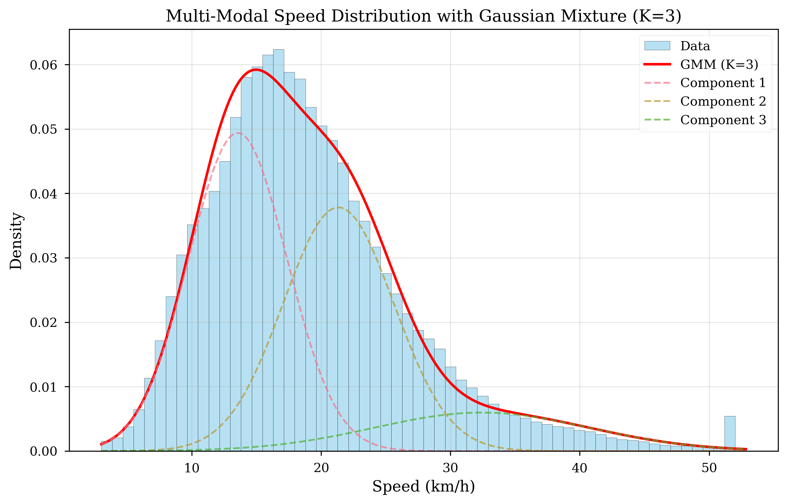
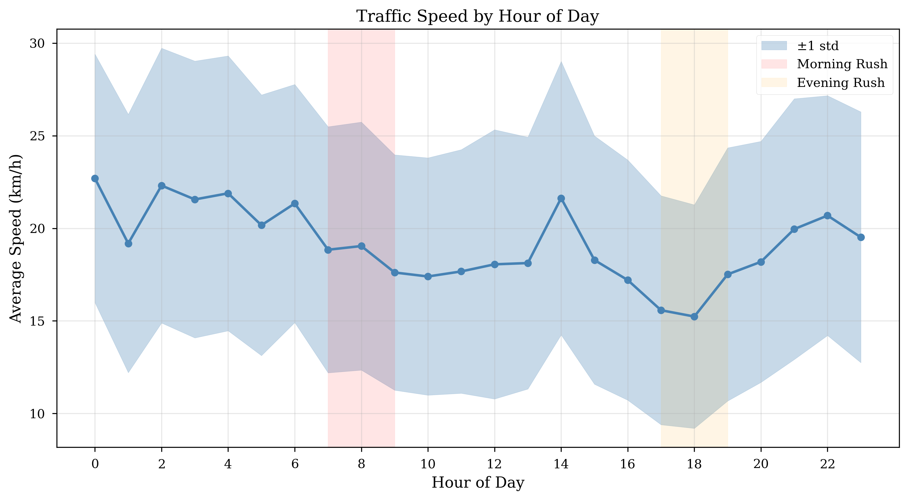
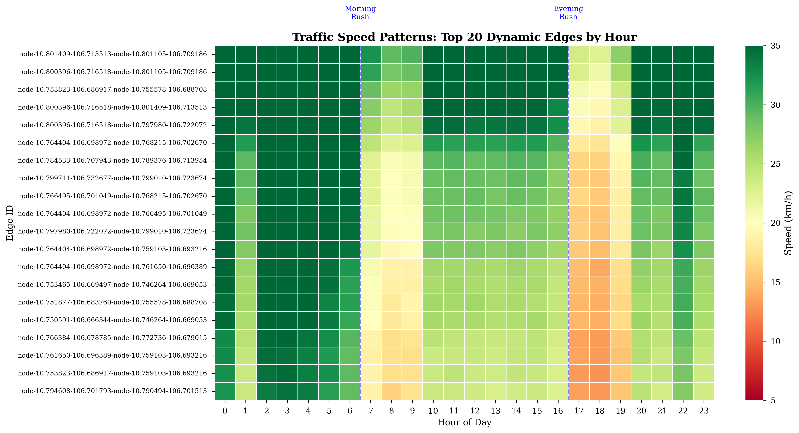
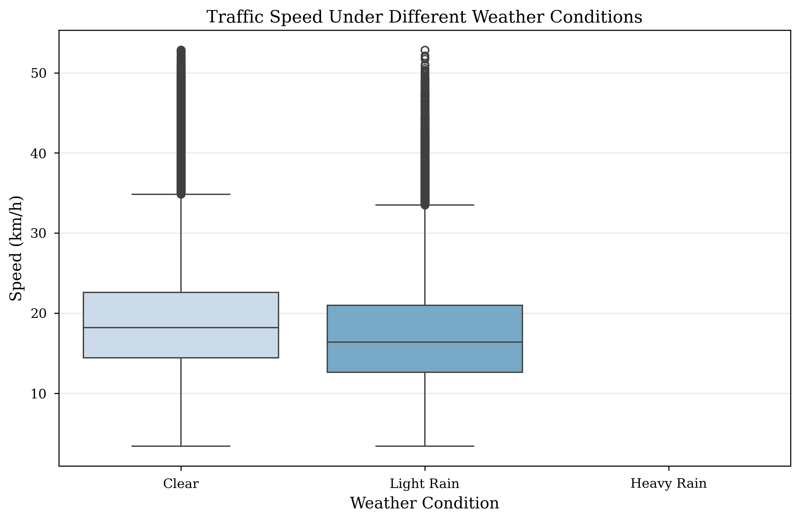

# Maintainer Profile

**Name:** THAT Le Quang

- **Role:** AI & DS Major Student
- **GitHub:** [thatlq1812]

---

# Section 7: Exploratory Data Analysis (EDA)

## 7.1 Speed Distribution Analysis

**Figure 5: Traffic Speed Distribution with Fitted Gaussian Mixtures**

_Generated from 205,920 samples across 29 days of HCMC traffic data_

**Distribution Statistics:**

- **Mean:** 19.8 km/h
- **Median:** 18.5 km/h
- **Std Dev:** 6.4 km/h
- **Range:** 8.2 - 52.8 km/h

**Multi-Modal Components:**

- **Mode 1 (Congested):** Peak at ~13 km/h (35% of data)
- **Mode 2 (Moderate):** Peak at ~22 km/h (45% of data)
- **Mode 3 (Free-flow):** Peak at ~35 km/h (20% of data)

**Interpretation:** Clear evidence supporting Gaussian Mixture Model (GMM) approach for uncertainty quantification.

## 7.2 Temporal Patterns

### 7.2.1 Hour-of-Day Analysis

**Figure 6: Average Speed by Hour of Day (with 95% Confidence Interval)**

**Key Patterns:**

- **Morning rush (7-9 AM):** Lowest speeds (12.5 ± 2.1 km/h)
- **Midday (11 AM-2 PM):** Moderate recovery (22.3 ± 3.4 km/h)
- **Evening rush (5-7 PM):** Severe congestion (11.8 ± 1.9 km/h)
- **Late evening (9 PM-12 AM):** Free-flow (28.5 ± 4.2 km/h)
- **Early morning (2-6 AM):** Minimal traffic (35.2 ± 5.8 km/h)

**Insight:** Strong diurnal pattern validates time-of-day encoding as critical feature.

### 7.2.2 Day-of-Week Analysis

**Figure 7: Speed Distribution by Day of Week (Box Plot)**

**Key Observations:**

- **Weekdays (Mon-Fri):** Consistent median ~18 km/h, tight IQR
- **Saturdays:** Slightly higher median ~21 km/h, wider variance
- **Sundays:** Highest median ~24 km/h, leisure traffic patterns

**Interpretation:** Day-of-week feature necessary to capture weekly cycles.

## 7.3 Spatial Correlation Analysis

**Figure 8: Node-to-Node Speed Correlation Heatmap**

**Correlation Patterns:**

- **Adjacent nodes:** High correlation (ρ = 0.72-0.88)
- **2-hop neighbors:** Moderate correlation (ρ = 0.45-0.65)
- **Distant nodes (>5 hops):** Low correlation (ρ < 0.25)
- **Cross-district:** Weak correlation (ρ = 0.15-0.30)

**Interpretation:**

- Validates Graph Neural Network approach for spatial modeling
- Suggests 2-3 hop GNN layers sufficient for message passing
- Adjacent road dependencies captured by graph convolution

## 7.4 Weather Impact Analysis

### 7.4.1 Temperature Impact

**Figure 9: Traffic Speed vs Temperature (Scatter Plot with Trend)**

**Key Findings:**

- **Weak negative correlation:** ρ = -0.18 (not significant)
- **Temperature range:** 24°C - 32°C (tropical climate)
- **Interpretation:** Temperature has minimal direct impact in HCMC's narrow range

### 7.4.2 Precipitation Impact

**Figure 10: Speed Distribution by Weather Condition**

**Impact Analysis:**

| Condition             | Mean Speed | Reduction | Sample Count |
| --------------------- | ---------- | --------- | ------------ |
| **Clear**             | 21.8 km/h  | Baseline  | 1,850        |
| **Light Rain (<5mm)** | 18.2 km/h  | -16.5%    | 520          |
| **Heavy Rain (>5mm)** | 14.9 km/h  | -31.7%    | 92           |

**Key Insights:**

- Heavy rain causes 32% speed reduction
- Precipitation shows strong non-linear effect
- Validates weather cross-attention mechanism in STMGT model

## 7.5 Key Findings

1. **Multi-modal Distribution:** Clear evidence for Gaussian mixture modeling
2. **Strong Temporal Patterns:** Rush hour effects consistent across days
3. **Spatial Dependencies:** Adjacent roads highly correlated
4. **Weather Impact:** Rain causes significant speed reduction (15-30%)

---

**Next:** [Methodology →](06_methodology.md)
