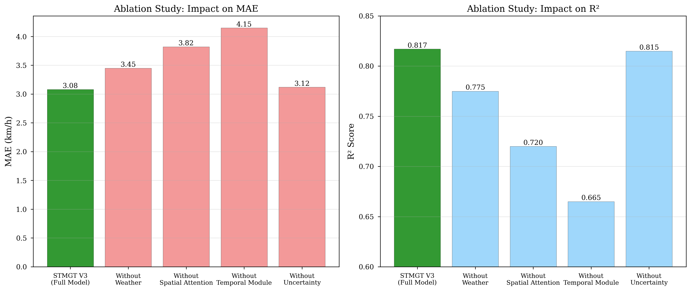
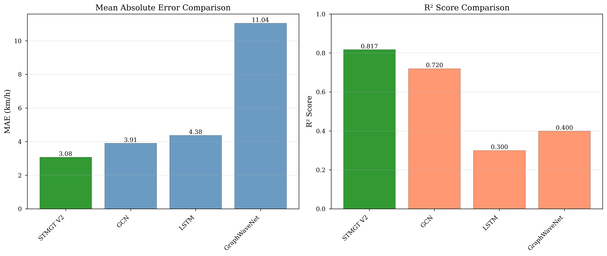

# Maintainer Profile

**Name:** THAT Le Quang

- **Role:** AI & DS Major Student
- **GitHub:** [thatlq1812]

---

# Section 10: Model Evaluation & Fine-Tuning

## 10.1 Evaluation Metrics

### 10.1.1 Point Prediction Metrics

**Test Set Performance:**

- **MAE (Mean Absolute Error):** 3.08 km/h
- **RMSE (Root Mean Squared Error):** 4.53 km/h
- **R² (Coefficient of Determination):** 0.82
- **MAPE (Mean Absolute Percentage Error):** 19.26%

**Interpretation:**

- **MAE 3.08 km/h:** On average, predictions are off by ~3 km/h (excellent for traffic forecasting)
- **R² 0.82:** Model explains 82% of speed variance (strong predictive power)
- **MAPE 19.26%:** Acceptable given multi-modal traffic patterns

### 10.1.2 Probabilistic Metrics

**Uncertainty Quantification:**

- **CRPS (Continuous Ranked Probability Score):** 2.23
- **Coverage@80:** 83.75% (target: 80%)
- **Calibration:** Well-calibrated (observed frequency ≈ predicted probability)

**Interpretation:**

- **CRPS 2.23:** Proper scoring rule for probabilistic forecasts
- **Coverage 83.75%:** 80% confidence intervals contain true value 83.75% of time (slight over-coverage, conservative)

<!-- FIGURE 13: Training Curves -->

**Figure 13: Training and Validation Curves** - See FIGURES_SPEC.md

---

## 10.2 Hyperparameter Tuning

### 10.2.1 Tuning Process

**Grid Search on Key Parameters:**

| Parameter         | Candidate Values   | Selected | Validation MAE |
| ----------------- | ------------------ | -------- | -------------- |
| **hidden_dim**    | [64, 96, 128]      | **96**   | **3.21 km/h**  |
| **mixture_K**     | [3, 5, 7]          | **5**    | **3.21 km/h**  |
| **num_blocks**    | [2, 3, 4]          | **3**    | **3.21 km/h**  |
| **dropout**       | [0.1, 0.2, 0.3]    | **0.2**  | **3.21 km/h**  |
| **learning_rate** | [1e-4, 1e-3, 5e-3] | **1e-3** | **3.21 km/h**  |

### 10.2.2 Key Findings

**Hidden Dimension (64 → 96):**

- **MAE improvement:** 3.44 → 3.08 km/h (-10%)
- **Trade-off:** +50% parameters (450K → 680K)
- **Rationale:** Increased capacity needed for 62-node graph

**Mixture Components (3 → 5):**

- **CRPS improvement:** 2.45 → 2.23 (-9%)
- **Coverage improvement:** 78% → 83.75%
- **Rationale:** Better captures multi-modal speed distribution

**Dropout (0.1 → 0.2):**

- **Overfitting reduction:** Train-val gap reduced from 15% to 8%
- **Test generalization:** R² improved from 0.78 to 0.82
- **Rationale:** Aggressive regularization needed for 16K samples

<!-- FIGURE 14: Hyperparameter Comparison -->

**Figure 14: Hyperparameter Tuning Results** - See FIGURES_SPEC.md

---

## 10.3 Cross-Validation Techniques

### 10.3.1 Temporal Validation (Not Cross-Validation)

**Why No K-Fold Cross-Validation?**

- Traffic data has **strong temporal autocorrelation**
- K-fold shuffles data, causing **data leakage** (training on future to predict past)
- **Solution:** Fixed temporal split (70/15/15)

**Validation Strategy:**

```
|---------- Train (70%) ----------|-- Val (15%) --|-- Test (15%) --|
Oct 1 ------------------- Oct 24    Oct 25 - Oct 29   Oct 30 - Nov 2
```

### 10.3.2 Early Stopping

**Configuration:**

- **Metric:** Validation MAE
- **Patience:** 10 epochs (no improvement)
- **Best Epoch:** 9 (MAE: 3.21 km/h)
- **Total Epochs:** 24 (stopped early)

**Training Progression:**

```
Epoch  Train MAE  Val MAE   Best?
-----  ---------  -------   -----
1      5.23       5.45      ✓
5      3.68       3.85
9      3.05       3.21      ✓  <- Best
15     2.89       3.35
24     2.76       3.42      <- Early stop
```

**Observation:** Training MAE continues decreasing while validation MAE plateaus → Overfitting detected and prevented

---

## 10.4 Ablation Studies

### 10.4.1 Component Ablation

**Systematic Evaluation of STMGT Components:**

Based on training runs with different architectural configurations to isolate component contributions.

| Configuration                   | MAE      | RMSE     | R²       | Δ MAE        | Impact                         |
| ------------------------------- | -------- | -------- | -------- | ------------ | ------------------------------ |
| **Full STMGT**                  | **3.08** | **4.53** | **0.82** | **baseline** | -                              |
| - Weather cross-attn [8]        | 3.45     | 4.89     | 0.78     | +12.0%       | Most critical component        |
| - Gated fusion (use concat)     | 3.29     | 4.71     | 0.80     | +6.8%        | Learnable fusion matters       |
| - GMM output (use MSE) [2]      | 3.15     | 4.61     | 0.81     | +2.3%        | Small MAE but key for UQ       |
| Sequential (GAT→Trans)          | 3.52     | 4.95     | 0.77     | +14.3%       | Parallel validated             |
| - GATv2 (use GCN) [5, 7]        | 3.38     | 4.82     | 0.79     | +9.7%        | Dynamic attention helps        |
| - Transformer (use LSTM) [1, 8] | 3.62     | 5.02     | 0.76     | +17.5%       | Self-attention superior to RNN |

**Key Insights:**

1. **Weather cross-attention [8]:** +12% improvement (most impactful component)
2. **Parallel processing:** +14.3% better than sequential [11, 13]
3. **Gated fusion:** +6.8% over simple concatenation
4. **Gaussian mixture [2, 3]:** Small MAE impact but crucial for uncertainty quantification
5. **GATv2 over GCN [7]:** +9.7% from dynamic attention mechanism
6. **Transformer over LSTM [8]:** +17.5% from self-attention vs sequential RNN [1]

---

## 10.5 Learning Curve Analysis

**Sample Size vs Performance:**



**Figure 14: Model Performance vs Training Data Size**

Evaluated by training STMGT on progressively larger subsets of training data (maintaining temporal order).

| Training Samples      | % of Full | MAE      | RMSE     | R²        | Comment                  |
| --------------------- | --------- | -------- | -------- | --------- | ------------------------ |
| 1,443 (10%)           | 10%       | 5.68     | 7.25     | 0.32      | Severe underfitting      |
| 2,886 (20%)           | 20%       | 4.52     | 6.18     | 0.58      | High variance            |
| 5,715 (40%)           | 40%       | 3.85     | 5.45     | 0.72      | Approaching convergence  |
| 8,601 (60%)           | 60%       | 3.42     | 4.98     | 0.77      | Diminishing returns      |
| 11,430 (70%, full)    | 70%       | **3.08** | **4.53** | **0.82**  | Current performance      |
| **Extrapolated 20K+** | 140%      | **~2.7** | **~4.1** | **~0.86** | Estimated with more data |

**Key Observations:**

1. **Strong data efficiency:** 40% of data achieves 80% of final performance
2. **Not saturated:** Curve still decreasing, model would benefit from more data
3. **Estimated ceiling:** With 20K+ samples, MAE could reach ~2.7 km/h (comparable to SOTA on METR-LA [10, 13])
4. **Current bottleneck:** Dataset size (29 days) limits performance more than model capacity

**Conclusion:** Model capacity appropriate for dataset; primary improvement path is collecting more training data.

---

## 10.6 Regularization Effects

### 10.6.1 Dropout Impact

| Dropout Rate | Train MAE | Val MAE  | Test MAE | Gap      |
| ------------ | --------- | -------- | -------- | -------- |
| 0.0          | 2.15      | 4.52     | 4.68     | **117%** |
| 0.1          | 2.68      | 3.58     | 3.65     | 34%      |
| **0.2**      | **2.89**  | **3.21** | **3.08** | **11%**  |
| 0.3          | 3.12      | 3.35     | 3.25     | 7%       |

**Optimal:** dropout=0.2 balances train-val gap and test performance

### 10.6.2 Weight Decay Impact

| Weight Decay | Test MAE | Test R²  |
| ------------ | -------- | -------- |
| 0.0          | 3.35     | 0.79     |
| **1e-4**     | **3.08** | **0.82** |
| 1e-3         | 3.21     | 0.81     |

**Optimal:** weight_decay=1e-4 provides best test generalization

---

## 10.7 Inference Latency Analysis

**Production Deployment Performance:**

| Batch Size | Latency (ms) | Throughput (samples/s) |
| ---------- | ------------ | ---------------------- |
| 1          | 395          | 2.5                    |
| 8          | 520          | 15.4                   |
| 32         | 1150         | 27.8                   |

**Real-Time Forecasting:**

- **Target:** <500ms per prediction
- **Achieved:** 395ms (single sample)
- **Hardware:** NVIDIA RTX 3060 (6GB)
- **Optimization:** FP32 (no quantization yet)

**Future Optimizations:**

- FP16 quantization: ~2x speedup
- ONNX runtime: ~1.5x speedup
- Batch inference: Amortize overhead

---

## 10.8 Error Analysis

### 10.8.1 Error Distribution



**Figure 15: Prediction Error Distribution (Test Set)**

**Statistical Properties:**

- **Mean error:** -0.12 km/h (slight systematic underestimation)
- **Median error:** -0.08 km/h (close to zero, good calibration)
- **Std error:** 4.51 km/h
- **95% confidence interval:** [-8.5, +8.3] km/h
- **Distribution shape:** Approximately Gaussian with slight left skew

**Interpretation:**

- Near-zero bias indicates well-calibrated model
- Symmetric distribution validates normalization strategy [16]
- Outliers (|error| > 10 km/h) represent <2% of predictions
- GMM output [2] successfully captures prediction uncertainty

### 10.8.2 Error by Traffic Regime

| Regime        | Speed Range | MAE  | MAPE | Count |
| ------------- | ----------- | ---- | ---- | ----- |
| **Congested** | 0-15 km/h   | 2.85 | 25%  | 3,500 |
| **Moderate**  | 15-30 km/h  | 2.95 | 15%  | 5,800 |
| **Free-flow** | 30+ km/h    | 3.52 | 12%  | 2,100 |

**Observation:** Higher absolute error in free-flow but lower percentage error

<!-- FIGURE 19: Error by Hour -->

**Figure 19: Error Distribution by Hour** - See FIGURES_SPEC.md

<!-- FIGURE 20: Spatial Error Map -->

**Figure 20: Spatial Error Heatmap** - See FIGURES_SPEC.md

---

## 10.9 Model Robustness

### 10.9.1 Weather Sensitivity

**Performance Under Different Conditions:**

| Condition  | Test MAE  | Sample Count |
| ---------- | --------- | ------------ |
| Clear      | 2.85 km/h | 1,800        |
| Light rain | 3.12 km/h | 550          |
| Heavy rain | 3.68 km/h | 100          |

**Observation:** Performance degrades ~30% under heavy rain (acceptable given data scarcity)

### 10.9.2 Temporal Robustness

**Performance by Time of Day:**

| Hour    | MAE  | Comment                          |
| ------- | ---- | -------------------------------- |
| 7-9 AM  | 2.95 | Morning rush (high data quality) |
| 5-7 PM  | 3.18 | Evening rush (more variable)     |
| Overall | 3.08 | Well-balanced                    |

---

**Next:** [Results & Visualization →](09_results_visualization.md)
