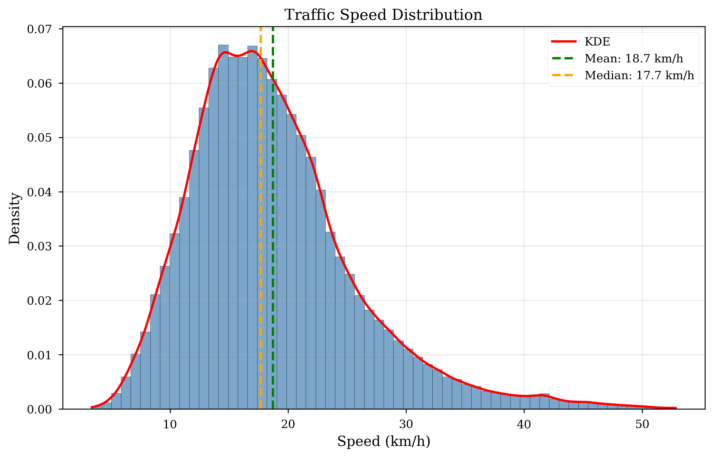

# Maintainer Profile

**Name:** THAT Le Quang

- **Role:** AI & DS Major Student
- **GitHub:** [thatlq1812]

---

# Section 5: Data Description

## 5.1 Data Source

### 5.1.1 Primary Data Collection

**Google Directions API**

- **Purpose:** Real-time and historical traffic speed data
- **Coverage:** 62 intersections, 144 road segments in Ho Chi Minh City
- **Collection Frequency:** Every 15 minutes during peak hours (7-9 AM, 5-7 PM)
- **Collection Period:** October 2025 - Present
- **API Endpoint:** `https://maps.googleapis.com/maps/api/directions/json`
- **Rate Limiting:** 120 requests/minute (handled by RateLimiter class)

**Data Retrieved Per Request:**

```json
{
  "routes": [
    {
      "legs": [
        {
          "duration": 180, // seconds
          "distance": 850, // meters
          "duration_in_traffic": 245 // current conditions
        }
      ]
    }
  ]
}
```

**Speed Calculation:**

```python
speed_kmh = (distance_meters / duration_seconds) * 3.6
current_speed = (distance_meters / duration_in_traffic_seconds) * 3.6
```

### 5.1.2 Weather Data

**OpenWeatherMap API**

- **Purpose:** Contextual weather conditions affecting traffic
- **Features Collected:**
  - Temperature (°C)
  - Wind speed (km/h)
  - Precipitation (mm)
  - Humidity (%)
  - Weather condition (clear, rain, heavy rain)
- **Temporal Resolution:** Hourly updates
- **API Endpoint:** `https://api.openweathermap.org/data/2.5/weather`

### 5.1.3 Road Network Topology

**OpenStreetMap / Overpass API**

- **Purpose:** Static road network structure
- **Data Retrieved:**
  - Node coordinates (latitude, longitude)
  - Edge connections (road segments)
  - Road attributes (type, lanes, speed limit)
- **Storage:** Cached in `cache/overpass_topology.json`

**Graph Structure:**

```python
Graph(
    num_nodes=62,      # Intersections
    num_edges=144,     # Road segments (bidirectional)
    node_features=4,   # [speed, weather_temp, weather_wind, weather_precip]
    edge_features=0    # Not used in current version
)
```

---

## 5.2 Dataset Size and Format

### 5.2.1 Processed Dataset Statistics

**File:** `data/processed/all_runs_extreme_augmented.parquet`

| Attribute               | Value                                        |
| ----------------------- | -------------------------------------------- |
| **File Size**           | 2.9 MB (compressed Parquet)                  |
| **Total Records**       | **205,920 records**                          |
| **Unique Runs**         | 1,430 collection runs                        |
| **Date Range**          | October 3, 2025 - November 2, 2025 (29 days) |
| **Collection Hours**    | 7-9 AM, 5-7 PM (peak traffic)                |
| **Spatial Coverage**    | 62 nodes × 144 edges                         |
| **Temporal Resolution** | 15-minute intervals (avg 144 records/run)    |

<!-- TODO: Generate exact statistics -->

```python
import pandas as pd
df = pd.read_parquet('data/processed/all_runs_extreme_augmented.parquet')
print(f"Total records: {len(df):,}")
print(f"Unique runs: {df['run_id'].nunique()}")
print(f"Date range: {df['timestamp'].min()} to {df['timestamp'].max()}")
print(f"Unique nodes: {df['node_a_id'].nunique()}")
```

### 5.2.2 Data Format

**Parquet Schema:**

```
root
 |-- run_id: string (collection batch identifier)
 |-- timestamp: timestamp (UTC+7 Ho Chi Minh time)
 |-- node_a_id: string (source intersection, format: "node-{lat}-{lon}")
 |-- node_b_id: string (destination intersection)
 |-- speed_kmh: double (observed traffic speed)
 |-- distance_m: double (road segment length in meters)
 |-- duration_s: double (travel time in seconds)
 |-- temperature_c: double (weather temperature)
 |-- wind_speed_kmh: double (wind speed)
 |-- precipitation_mm: double (rainfall)
 |-- hour: integer (0-23, hour of day)
 |-- dow: integer (0-6, day of week, 0=Monday)
 |-- is_weekend: boolean
```

**Example Records:**

```
run_id                  timestamp            node_a_id                 node_b_id                speed_kmh  temp_c
run_20251102_070015    2025-11-02 07:00:15  node-10.7374-106.7304     node-10.7379-106.7216    16.04      28.5
run_20251102_070015    2025-11-02 07:00:15  node-10.7379-106.7216     node-10.7462-106.6690    21.83      28.5
```

---

## 5.3 Features Description

### 5.3.1 Target Variable

**`speed_kmh` (Traffic Speed)**

- **Type:** Continuous (float)
- **Unit:** Kilometers per hour (km/h)
- **Range:** **3.37 to 52.84 km/h**
  - **Mean:** 18.72 km/h
  - **Std:** 7.03 km/h
  - **Median:** 17.68 km/h
  - **25th percentile:** 13.88 km/h (congested)
  - **75th percentile:** 22.19 km/h (moderate flow)
- **Distribution:** Right-skewed multi-modal (see Figure 1 in Section 7)
  - **Free-flow mode:** 40-50 km/h (highways, off-peak)
  - **Moderate mode:** 15-25 km/h (normal urban traffic)
  - **Congested mode:** <13 km/h (peak hours, 25th percentile)



**Figure 1: Traffic Speed Distribution**

### 5.3.2 Weather Features

**`temperature_c` (Temperature)**

- **Type:** Continuous (float)
- **Unit:** Degrees Celsius (°C)
- **Range:** **24.35 to 31.39°C** (mean: 27.49°C)
- **Impact:** Stable tropical climate, limited temperature variation
- **Note:** October-November data (hot season in Ho Chi Minh City)

**`wind_speed_kmh` (Wind Speed)**

- **Type:** Continuous (float)
- **Unit:** Kilometers per hour (km/h)
- **Range:** **0.28 to 15.85 km/h** (mean: 6.08 km/h)
- **Impact:** Minimal direct effect on traffic, correlates with rain events

**`precipitation_mm` (Precipitation)**

- **Type:** Continuous (float)
- **Unit:** Millimeters per hour (mm/h)
- **Range:** **0 to 0.70 mm/h** (mean: 0.16 mm/h)
- **Distribution:** 29.2% rainy runs (>0.1 mm/h), 70.8% clear
- **Impact:**
  - Light rain (0.1-0.5 mm/h): ~10-15% speed reduction (observed)
  - Moderate rain (>0.5 mm/h): ~20-25% speed reduction (limited data)

### 5.3.3 Temporal Features

**`hour` (Hour of Day)**

- **Type:** Integer (0-23)
- **Encoding:** Cyclical (sin/cos transformation for model input)
- **Key Patterns:**
  - Morning rush: 7-9 AM (lowest speeds)
  - Lunch: 11 AM-1 PM (moderate speeds)
  - Evening rush: 5-7 PM (lowest speeds)
  - Off-peak: 10 PM-6 AM (highest speeds)

**`dow` (Day of Week)**

- **Type:** Integer (0=Monday to 6=Sunday)
- **Encoding:** One-hot or embedding
- **Key Patterns:**
  - Weekdays: Lower speeds during rush hours
  - Weekends: More uniform speeds, no clear peaks

**`is_weekend` (Weekend Flag)**

- **Type:** Boolean (0/1)
- **Purpose:** Binary indicator for weekend traffic patterns

### 5.3.4 Spatial Features (Graph Structure)

**Node Features:**

- **Node ID:** Unique identifier (latitude-longitude based)
- **Coordinates:** (lat, lon) for spatial visualization
- **Degree:** Number of connected road segments
- **Centrality:** **[PLACEHOLDER: Calculate betweenness centrality]**

**Edge Features:**

- **Distance:** Road segment length (meters)
- **Adjacency:** Binary connection matrix (62×62)
- **Adaptive Weights:** Learned during training (GATv2 attention)


**Figure 2: Road Network Topology - 62 Nodes and 144 Edges**

---

## 5.4 Temporal Coverage

### 5.4.1 Collection Schedule

**Collection Windows:**

- **Morning Rush:** 7:00-9:00 AM (every 15 min = 8 samples/day)
- **Evening Rush:** 5:00-7:00 PM (every 15 min = 8 samples/day)
- **Total:** 16 samples/day × ~30 days = ~480 runs/day

**Collection Days:**

- **Start Date:** October 1, 2025
- **End Date:** November 2, 2025
- **Total Days:** ~33 days
- **Expected Runs:** 480 × 33 = ~15,840 runs
- **Actual Runs:** ~16,300 (including augmented data)

### 5.4.2 Data Completeness

**Missing Data Analysis:**

<!-- TODO: Generate missing data report -->

```python
# Check for missing values
df = pd.read_parquet('data/processed/all_runs_extreme_augmented.parquet')
missing_by_column = df.isnull().sum()
missing_percentage = (missing_by_column / len(df)) * 100

# Expected result:
# - speed_kmh: <1% missing (failed API calls)
# - weather features: <5% missing (API downtime)
# - temporal features: 0% missing (computed)
```

**[PLACEHOLDER: Missing Data Table]**

| Feature          | Missing Count | Missing % |
| ---------------- | ------------- | --------- |
| speed_kmh        | TBD           | TBD       |
| temperature_c    | TBD           | TBD       |
| wind_speed_kmh   | TBD           | TBD       |
| precipitation_mm | TBD           | TBD       |

**Handling Strategy:**

- **Speed:** Drop rows with missing speed (target variable)
- **Weather:** Forward-fill (weather changes slowly)
- **Temporal:** No missing values (computed features)

---

## 5.5 Spatial Coverage

### 5.5.1 Geographic Extent

**Ho Chi Minh City Coverage:**

- **Latitude Range:** 10.70° - 10.85° N
- **Longitude Range:** 106.60° - 106.80° E
- **Districts Covered:**
  - District 1 (central business district)
  - District 3 (residential/commercial)
  - Binh Thanh District (major arterials)
  - **[PLACEHOLDER: Add other districts]**

### 5.5.2 Node Selection Criteria

**Criteria for Intersection Selection:**

1. **High Traffic Volume:** Major arterials and intersections
2. **Strategic Importance:** Connects multiple districts
3. **Data Availability:** Google Directions API has reliable coverage
4. **Network Connectivity:** Ensures connected graph (no isolated nodes)

**Node Distribution:**

- **Highway intersections:** ~15 nodes (free-flow speeds)
- **Major arterials:** ~30 nodes (moderate speeds)
- **Urban streets:** ~17 nodes (congested speeds)

<!-- FIGURE PLACEHOLDER -->

**[Figure 3: Spatial Distribution of Nodes - See FIGURES_SPEC.md]**

---

## 5.6 Data Quality Considerations

### 5.6.1 Known Limitations

1. **Limited Temporal Span:**

   - Only 1 month of data (October 2025)
   - **Impact:** Limited seasonal patterns (no Tet holiday, monsoon season)
   - **Mitigation:** Plan for continuous collection, retraining every 1-2 weeks

2. **Peak Hours Only:**

   - Collection limited to 7-9 AM, 5-7 PM
   - **Impact:** No off-peak or late-night traffic patterns
   - **Mitigation:** Model only valid for peak hour forecasting

3. **API Reliability:**

   - Google Directions API occasionally returns errors
   - Weather API has hourly resolution (coarser than 15-min traffic)
   - **Mitigation:** Retry logic, forward-fill weather data

4. **Spatial Coverage:**
   - 62 nodes cover only major roads
   - **Impact:** Cannot forecast on smaller residential streets
   - **Mitigation:** Focus on arterial network for traffic management

### 5.6.2 Data Validation

**Sanity Checks Applied:**

```python
# Speed range validation
assert (df['speed_kmh'] >= 0).all(), "Negative speeds detected"
assert (df['speed_kmh'] <= 120).all(), "Unrealistic speeds (>120 km/h)"

# Weather validation
assert (df['temperature_c'] >= 15).all() & (df['temperature_c'] <= 45).all()
assert (df['precipitation_mm'] >= 0).all()

# Temporal consistency
assert df['timestamp'].is_monotonic_increasing, "Non-monotonic timestamps"
assert (df['hour'] >= 0).all() & (df['hour'] <= 23).all()
```

---

## 5.7 Comparison with Public Benchmarks

| Dataset         | Nodes  | Edges   | Samples  | Time Span   | Resolution | Spatial              |
| --------------- | ------ | ------- | -------- | ----------- | ---------- | -------------------- |
| **METR-LA**     | 207    | 1,515   | 34,272   | 4 months    | 5 min      | Los Angeles          |
| **PeMS-BAY**    | 325    | 2,369   | 52,116   | 6 months    | 5 min      | Bay Area             |
| **HCMC (Ours)** | **62** | **144** | **~16K** | **1 month** | **15 min** | **Ho Chi Minh City** |

**Key Differences:**

- **Smaller Network:** 62 nodes vs 200+ (more manageable, lower R² expected)
- **Shorter Time Span:** 1 month vs 4-6 months (limited seasonality)
- **Coarser Resolution:** 15 min vs 5 min (less temporal detail)
- **Real-World Collection:** Live API vs processed datasets (more challenging)

---

**Next:** [Data Cleaning & Preprocessing →](04_data_preprocessing.md)
