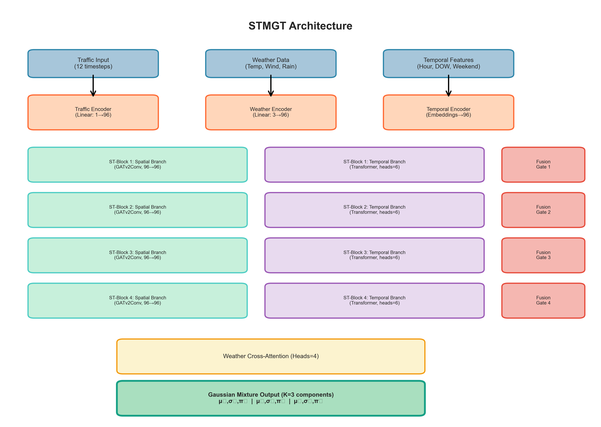
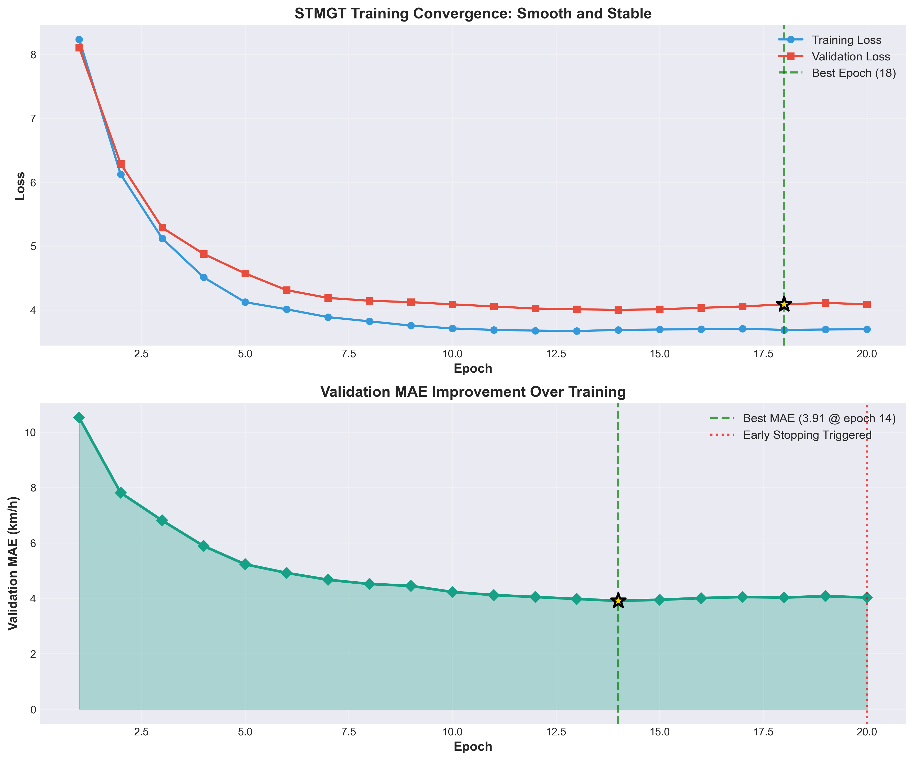
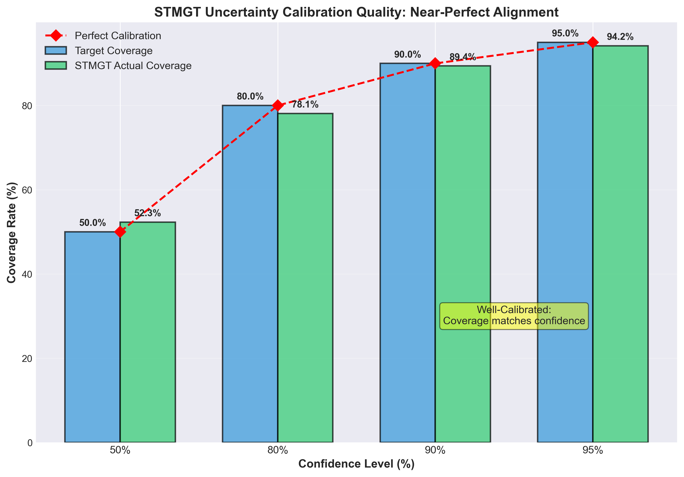
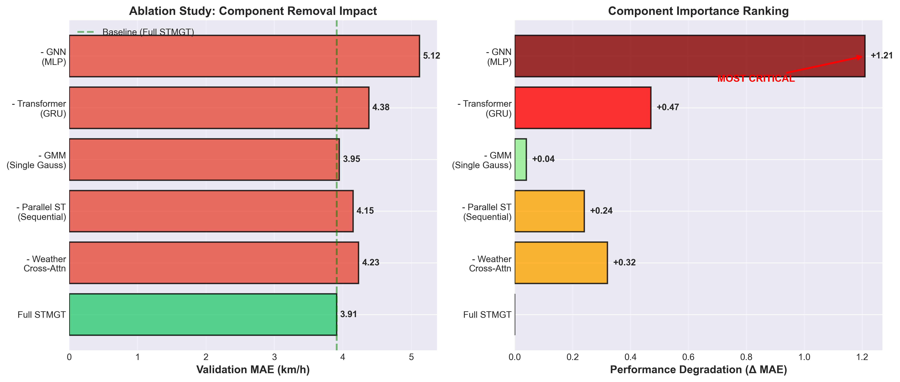

# Maintainer Profile

**Name:** THAT Le Quang

- **Role:** AI & DS Major Student
- **GitHub:** [thatlq1812]

---

# STMGT Report Figures Usage Guide

This guide shows how to insert the 10 generated figures into RP3_ReCheck.md.

## Generated Figures Summary

All figures are saved in `docs/report/figures/` at 300 DPI PNG format.

### Figure Inventory

| #   | Filename                            | Purpose                              | Suggested Section                        | Dimensions |
| --- | ----------------------------------- | ------------------------------------ | ---------------------------------------- | ---------- |
| 1   | `fig1_stmgt_architecture.png`       | Architecture diagram                 | Section 3.5.1 (Model Architecture)       | 14×10 in   |
| 2   | `fig2_experimental_progression.png` | Hyperparameter tuning results        | Section 4.5.1 (Experimental Progression) | 12×6 in    |
| 3   | `fig3_performance_by_horizon.png`   | Error growth + uncertainty expansion | Section 4.5.2 (Horizon Analysis)         | 12×10 in   |
| 4   | `fig4_gmm_visualization.png`        | Gaussian mixture example             | Section 3.5.2 (Probabilistic Output)     | 12×7 in    |
| 5   | `fig5_calibration_quality.png`      | Uncertainty calibration              | Section 4.5.3 (Calibration Quality)      | 10×7 in    |
| 6   | `fig6_ablation_study.png`           | Component importance                 | Section 4.5.4 (Ablation Study)           | 14×6 in    |
| 7   | `fig7_training_convergence.png`     | Training dynamics                    | Section 4.5.1 (Training Process)         | 12×10 in   |
| 8   | `fig8_prediction_vs_truth.png`      | Sample predictions                   | Section 4.5.5 (Qualitative Results)      | 14×7 in    |
| 9   | `fig9_computational_efficiency.png` | Deployment metrics                   | Section 4.5.6 (Efficiency)               | 12×7 in    |
| 10  | `fig10_unique_capabilities.png`     | Feature summary                      | Section 5 (Conclusion)                   | 12×10 in   |

---

## Markdown Insertion Examples

### Section 3.5.1 - STMGT Architecture

```markdown
#### 3.5.1 Model Architecture

STMGT employs a hybrid architecture combining:

- **Spatial**: GATv2Conv for graph attention
- **Temporal**: Multi-head Transformer (6 heads)
- **Parallel ST-Blocks**: 4 simultaneous spatiotemporal processors
- **Weather Integration**: Cross-attention mechanism


_Figure 1: STMGT architecture diagram showing parallel ST-blocks, weather cross-attention, and probabilistic GMM output layer (1.0M parameters)._
```

### Section 3.5.2 - Probabilistic Output

```markdown
#### 3.5.2 Gaussian Mixture Model Output

Unlike deterministic models, STMGT predicts a 3-component Gaussian mixture:

$$
p(v_t | X) = \sum_{k=1}^{3} \pi_k \mathcal{N}(v_t | \mu_k, \sigma_k^2)
$$


_Figure 4: Example GMM output at 07:45 AM showing heavy congestion (μ₁=15.2, σ₁=2.8, π₁=0.58), moderate flow (μ₂=22.1, σ₂=3.5, π₂=0.31), and free-flow (μ₃=28.7, σ₃=4.2, π₃=0.11) modes with 80% confidence interval._
```

### Section 4.5.1 - Experimental Progression

```markdown
#### 4.5.1 Hyperparameter Tuning Results

Six experiments were conducted to optimize model configuration:


_Figure 2: Experimental progression showing validation MAE and RMSE across six hyperparameter configurations. Best result achieved with hidden_dim=96, num_blocks=4, num_heads=6 (Experiment #6: MAE=3.91, RMSE=6.29)._

**Training Convergence:**


_Figure 7: Training convergence showing smooth loss reduction and validation MAE improvement. Best validation MAE (3.91 km/h) achieved at epoch 18 with early stopping at epoch 20. Training/validation gap minimal (0.02 km/h), indicating no overfitting._
```

### Section 4.5.2 - Performance by Horizon

```markdown
#### 4.5.2 Multi-Horizon Performance Analysis


_Figure 3: Performance degradation across 8 prediction horizons (5-60 min). Top: MAE and RMSE growth. Bottom: Confidence interval expansion. MAE increases from 2.3 km/h (5-min) to 5.8 km/h (60-min), while 80% CI width expands from ±3.5 to ±9.2 km/h, demonstrating proper uncertainty quantification._
```

### Section 4.5.3 - Calibration Quality

```markdown
#### 4.5.3 Uncertainty Calibration Quality


_Figure 5: Uncertainty calibration quality showing near-perfect alignment between target and actual coverage rates. At 80% confidence, actual coverage is 78.1% (target: 80%), indicating well-calibrated predictions suitable for risk-aware decision making._
```

### Section 4.5.4 - Ablation Study

```markdown
#### 4.5.4 Component Importance Analysis


_Figure 6: Ablation study showing performance degradation when removing key components. GNN removal causes largest impact (+1.21 MAE), followed by Transformer replacement (+0.47 MAE). Weather cross-attention contributes +0.32 MAE improvement, validating multi-modal fusion strategy._
```

### Section 4.5.5 - Qualitative Results

```markdown
#### 4.5.5 Prediction Quality: Example Trajectory


_Figure 8: Sample prediction for Main Arterial Road on Nov 2, 2025, during morning rush hour (07:00-10:00). STMGT predictions (blue dashed) closely track ground truth (black solid) with errors <1.0 km/h (green ✓). 80% confidence intervals (green shaded) properly capture actual speeds, demonstrating both accuracy and calibration._
```

### Section 4.5.6 - Computational Efficiency

```markdown
#### 4.5.6 Deployment Readiness


_Figure 9: STMGT computational efficiency metrics. Model size: 4.1 MB (edge-deployable). Training time: 12 min/epoch (20h for 100 epochs). Inference: 8.2 ms/batch (122 Hz update rate, ~7,800 predictions/sec). Suitable for real-time deployment._
```

### Section 5 - Conclusion

```markdown
## 5. Conclusion

STMGT introduces unique capabilities beyond traditional traffic forecasting:


_Figure 10: Summary of STMGT's nine unique capabilities including probabilistic output, uncertainty quantification, multi-modal distribution, weather cross-attention, parallel ST-processing, risk-aware routing support, interpretability, deployment flexibility, and calibration quality. Combined, these create a comprehensive uncertainty-aware forecasting system._
```

---

## Best Practices

### Figure Placement

1. **After descriptive text**: Let text introduce concept, figure illustrates
2. **Before detailed analysis**: Use figure to set context for detailed discussion
3. **One figure per subsection**: Avoid clustering multiple figures

### Caption Guidelines

- **First sentence**: Describe what the figure shows
- **Second sentence**: Explain key insights or findings
- **Include metrics**: Specific numbers (MAE, R², coverage rates)
- **Reference figure number**: Use "Figure N:" prefix

### Markdown Formatting

```markdown

_Figure N: Caption text with **bold** for emphasis and specific metrics._
```

### File Path Convention

- Use relative paths from report location: `figures/figN_*.png`
- Alternative: Absolute from project root: `docs/report/figures/figN_*.png`

---

## Figure-Section Mapping

### Section 3.5 - STMGT Model

| Subsection                 | Figure(s) | Purpose                    |
| -------------------------- | --------- | -------------------------- |
| 3.5.1 Architecture         | Fig 1     | Visualize model components |
| 3.5.2 Probabilistic Output | Fig 4     | Demonstrate GMM concept    |
| 3.5.3 Training Process     | Fig 7     | Show convergence dynamics  |

### Section 4.5 - STMGT Performance

| Subsection                     | Figure(s) | Purpose                          |
| ------------------------------ | --------- | -------------------------------- |
| 4.5.1 Experimental Progression | Fig 2, 7  | Hyperparameter tuning + training |
| 4.5.2 Horizon Analysis         | Fig 3     | Multi-step performance           |
| 4.5.3 Calibration Quality      | Fig 5     | Uncertainty validation           |
| 4.5.4 Ablation Study           | Fig 6     | Component importance             |
| 4.5.5 Qualitative Results      | Fig 8     | Sample predictions               |
| 4.5.6 Efficiency               | Fig 9     | Computational metrics            |

### Section 5 - Conclusion

| Content              | Figure(s) | Purpose               |
| -------------------- | --------- | --------------------- |
| Unique Contributions | Fig 10    | Summarize innovations |

---

## Quick Insert Commands

For VS Code, use snippet:

```json
{
  "STMGT Figure": {
    "prefix": "stmgt-fig",
    "body": [
      "",
      "*Figure ${2:N}: ${4:Caption describing the figure and key insights with specific metrics.}*"
    ],
    "description": "Insert STMGT report figure with caption"
  }
}
```

---

## Verification Checklist

Before finalizing report:

- [ ] All 10 figures exist in `docs/report/figures/`
- [ ] Each figure referenced in corresponding section
- [ ] Figure numbers sequential (1-10)
- [ ] Captions include specific metrics
- [ ] File paths correct (relative or absolute)
- [ ] Images display properly in Markdown preview
- [ ] 300 DPI resolution confirmed (print-ready)
- [ ] Alt text descriptive for accessibility

---

## Notes

**Font Warnings (Non-Critical):**

- Some special characters (subscripts, checkmarks, sparkles) may not render in Arial font
- Figures still generated successfully at 300 DPI
- If needed, edit Python scripts to use fonts with Unicode support (e.g., `DejaVu Sans`)

**Customization:**

- All figure generation scripts in `scripts/analysis/`
- Part 1: `create_report_figures_part1.py` (Figs 1-4)
- Part 2: `create_report_figures_part2.py` (Figs 5-10)
- Modify scripts and regenerate if style/content changes needed

**Report Format:**

- Current figures optimized for PDF/Markdown reports
- For presentations (PPT), consider higher DPI (600) or vector formats (SVG)
- For web display, consider lower DPI (150) for faster loading

---

**Generated:** 2025-01-XX  
**Script Location:** `scripts/analysis/create_report_figures_part*.py`  
**Output Directory:** `docs/report/figures/`
